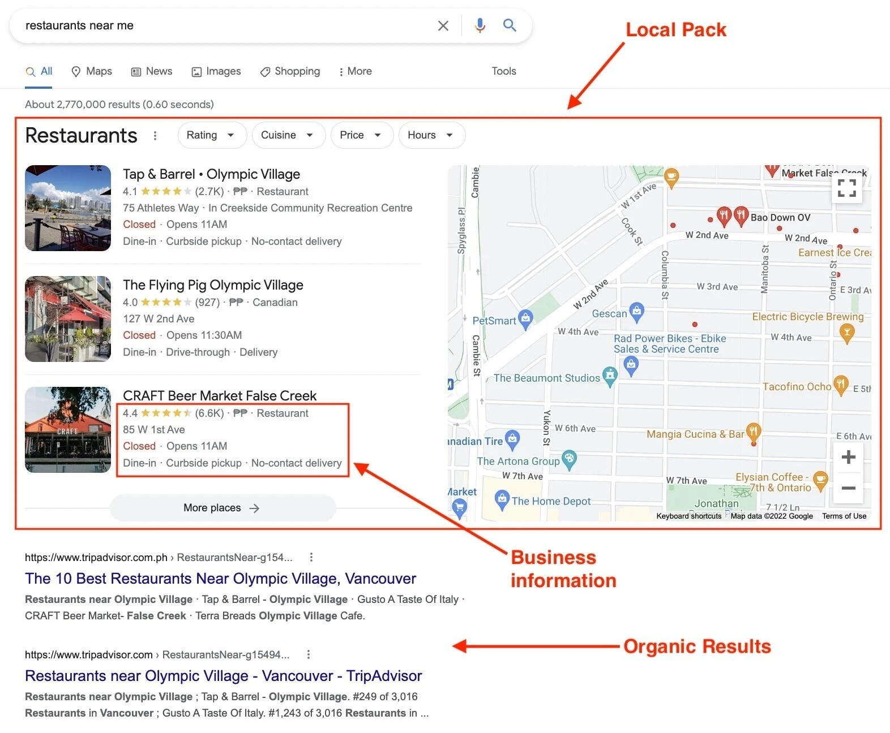
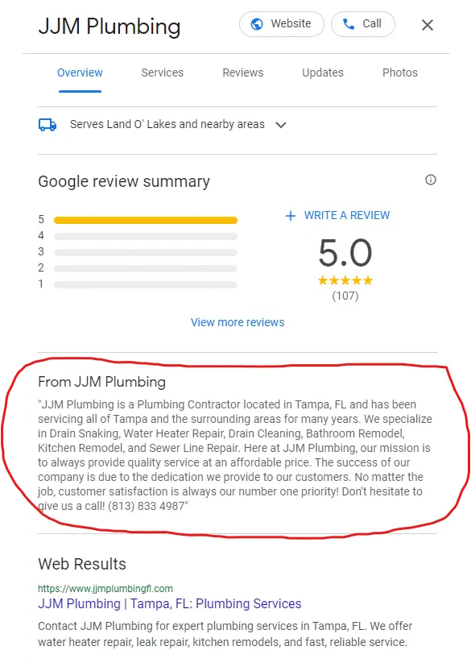
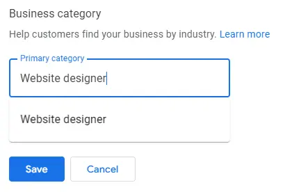

In today’s digital age, having a strong online presence is essential for any business, regardless of size or industry. One of the most effective and often overlooked tools for boosting visibility is a well-optimized Google Business Profile (GBP). Formerly known as Google My Business, this free tool allows businesses to manage how they appear on Google Search and Maps, providing crucial information that can turn searchers into customers.

## Why Your Google Business Profile Matters

Google is the go-to search engine for billions of users worldwide. Whether someone is looking for a local restaurant, a service provider, or a retail store, one of the first things they’ll see is a business’s Google Business Profile. This profile serves as your business’s virtual storefront, offering a snapshot of what you offer, where you’re located, and how to get in touch.

An optimized profile can:

- **Increase Visibility in Local Search Results:** When your profile is fully optimized, Google is more likely to rank it higher in local search results. This means when potential customers search for services like yours in your area, your business will be easier to find.

- **Enhance Customer Trust:** A complete profile that includes accurate business hours, contact information, and photos builds credibility. Customers are more likely to trust businesses that provide detailed information and have positive reviews.
- **Drive More Traffic and Conversions**: With essential information like phone numbers, websites, and directions readily available, users are more likely to engage with your business. Studies show that businesses with an optimized GBP are more likely to receive calls, visits, and website clicks directly from their profile.

## Key Elements of An Optimized Google Business Profile

1. **Accurate Information**: Make sure your business name, address, phone number (NAP), and hours of operation are always up-to-date. Consistency is key, as mismatches between your website and Google can hurt your rankings.
2. **Business Description**: Use the description section to tell potential customers about your business, what you offer, and what sets you apart. Be concise but include relevant keywords that reflect the services or products you provide.
    
    
    
3. **Photos and Videos**: Visuals are powerful. High-quality images of your business location, team, or products can significantly boost your profile’s appeal. According to Google, businesses with photos receive 42% more requests for directions and 35% more clicks to their website.
4. **Google Reviews**: Positive reviews not only improve your business’s credibility but also influence your search ranking. Encourage satisfied customers to leave reviews and always respond to them, whether positive or negative, to show that you value feedback.
5. **Categories and Attributes**: Choosing the right category for your business is essential for appearing in relevant searches. Attributes, such as "wheelchair accessible" or "outdoor seating," provide additional information that can help attract the right customers.
    
    
    
6. **Posts and Updates**: Google Business Profile allows you to post updates, offers, and events. Regularly posting can keep your profile fresh and show Google that you’re an active business, which can positively impact your ranking.

## How an Optimized Profile Boosts SEO

Google’s algorithm considers several factors when ranking businesses in local search results. Having an optimized GBP is one of the most important of these. When you regularly update your profile, respond to reviews, and keep your information current, you signal to Google that your business is trustworthy and relevant.

In addition, optimizing your profile with relevant keywords (especially in your business description) increases your chances of appearing in searches related to your services.

## Real-World Example: Using Relevant Keywords for a Restaurant’s Google Business Profile

Let’s say you own a seafood restaurant in Miami. To get more customers, you want to ensure your restaurant appears in local search results when people are looking for places to eat seafood in the area. Here’s how you can use relevant keywords to optimize your Google Business Profile.

1. **Business Description:** In your business description, incorporate keywords that reflect what your restaurant offers and what customers are likely to search for. For example:
- **Before**: “We are a restaurant in Miami serving delicious meals.”
- **After**: “At Ocean Breeze Seafood Restaurant in Miami, we specialize in fresh, locally caught seafood including lobster, shrimp, and grouper. Enjoy our oceanfront dining experience, complete with a full bar and the best seafood platters in Miami Beach.”

The optimized version includes keywords like “seafood restaurant in Miami,” “locally caught seafood,” and “best seafood platters in Miami Beach.” These are terms people searching for seafood dining options in Miami might use, increasing the chances of your business showing up in their search results.

1. **Categories and Attributes:** Choose relevant categories and attributes to help Google and customers understand what your restaurant offers. For example:
- **Primary category**: Seafood restaurant
- **Additional categories**: Fine dining, outdoor seating, family-friendly restaurant
- **Attributes**: Oceanfront, outdoor seating, vegetarian options

Including categories like “seafood restaurant” or attributes like “outdoor seating” will help your restaurant appear in searches related to those features, such as “restaurants with outdoor seating in Miami.”

1. **Posts and Updates**:
When promoting a special event or menu item, incorporate location-based and food-related keywords. For example:
- **Post**: “Join us for Lobster Fest this weekend at Ocean Breeze Seafood Restaurant in Miami! Enjoy a special menu featuring grilled lobster, seafood pasta, and key lime pie, all with stunning views of the ocean.”

Using terms like “Lobster Fest,” “seafood pasta,” and “Miami” in your posts can help people who are searching for special dining experiences or specific seafood dishes in the Miami area.

1. **Photos and Image Tags**:
While the content of the images is important, so is how you describe them. When uploading photos of your restaurant, use relevant keywords in the filenames or captions, such as:
- “Miami seafood restaurant outdoor seating”
- “Grilled shrimp and lobster at Ocean Breeze Miami”

These descriptions help Google understand what’s in the photos and can improve your chances of appearing in image searches as well.

By strategically using keywords throughout your Google Business Profile, you not only increase your chances of being discovered in local search results but also target specific customers who are looking for exactly what you offer.

### Final Thoughts

Your Google Business Profile is more than just a directory listing. It’s a crucial component of your overall SEO strategy that can drive more traffic, build trust, and increase your business’s visibility. By taking the time to optimize it, you’re not only improving your chances of being found online but also enhancing the experience of potential customers looking for your services.

Investing in your Google Business Profile today can lead to more traffic, more leads, and ultimately more revenue for your business.