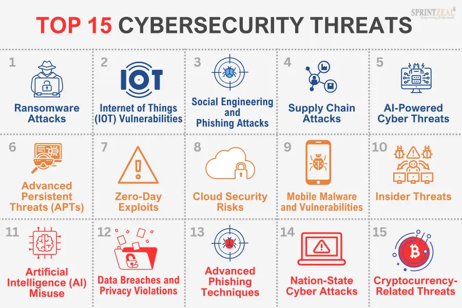
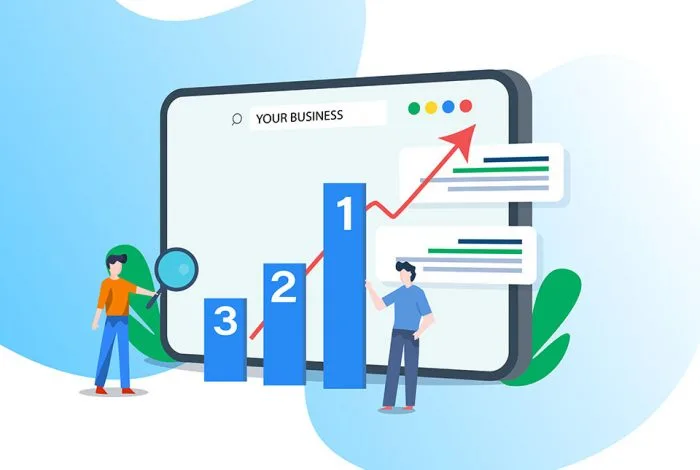
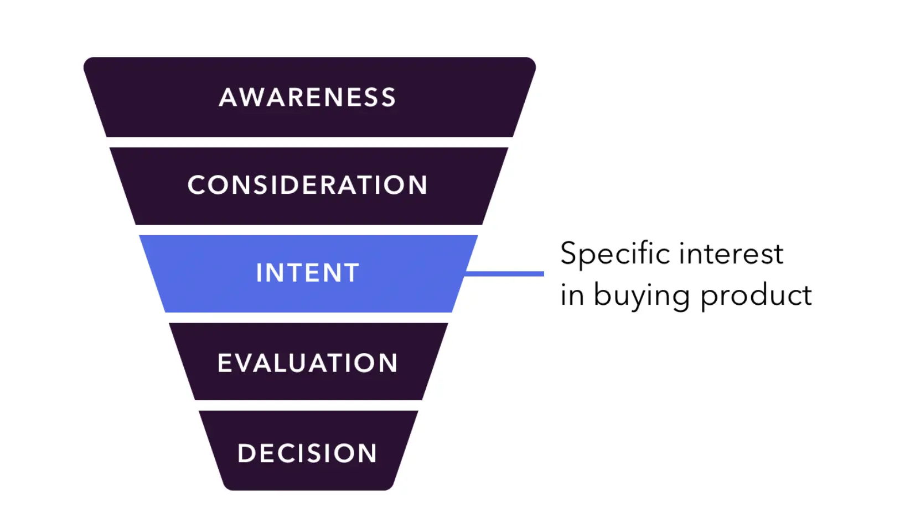

In today’s competitive landscape, B2B content marketing is essential for businesses looking to create meaningful relationships, drive growth, and establish industry authority. Content marketing, particularly within the B2B sector, allows businesses to showcase their expertise, address potential clients' pain points, and build trust long before a purchase decision is made. This article covers why B2B content marketing is crucial, strategies to implement, and the types of content that resonate best with B2B audiences.

## Why B2B Content Marketing Matters

1. **Increased Brand Authority and Credibility:** Sharing valuable insights, industry expertise, and solutions to common pain points builds authority. Clients seeking a solution to their challenges are more likely to trust businesses that demonstrate an in-depth understanding of their industry.

Here is a **real world example** of sharing valuable insights and information as a B2B company: 

Imagine a company that offers cybersecurity software for small to medium-sized businesses. To establish authority in this space, they might publish a series of blog posts and whitepapers about common security threats facing SMBs, such as ransomware or phishing scams. They could also share in-depth articles on best practices for remote work security or compliance regulations in various industries.

Over time, these resources establish the company as a go-to authority on cybersecurity for small businesses. When potential clients, such as IT managers or business owners, search for information on cybersecurity solutions, they come across these articles. They see that the company understands their challenges and provides credible, expert insights into solutions.

When the time comes to choose a cybersecurity vendor, those clients are more likely to trust and consider this company because of its proven authority. This expertise, demonstrated through content, builds a relationship of trust and positions the company as a credible and reliable option in the eyes of potential B2B clients.

[**DevVibe Studio**](https://www.devvibestudio.com) can help any business setup and optimize a CMS (Content Management System) so they too can become the industry leader in authority.

1. **Improved Search Engine Rankings:** Quality content not only appeals to potential clients but also attracts search engines. Consistently publishing high-value content using targeted keywords helps improve organic visibility, making it easier for B2B clients to find your services.

For instance, by creating a series of blog posts, case studies, or how-to guides around keywords that address your audience’s pain points, you can attract organic traffic from prospective clients actively seeking expertise in your field. Beyond just driving visitors, this organic search traffic brings in leads who are already researching specific solutions, meaning they are further along in the buying process and more likely to convert.

By consistently appearing in search results, you can position your brand as a top solution and build a recognizable presence, increasing the likelihood that potential clients will trust your brand and think of you first when they’re ready to buy.

1. **Educated Buyers with Higher Conversion Potential**: B2B clients tend to conduct extensive research before making purchase decisions. By offering educational content, you empower potential clients to make informed choices—ultimately leading to higher conversion rates as they already trust your expertise.

    
    
    

## Developing a B2B Content Marketing Strategy

1. **Define Your Target Audience and Buyer Personas**: Start by understanding who you’re talking to. Define your ideal clients’ demographics, their industry challenges, and the solutions they’re seeking. Create content that resonates with specific buyer personas to increase engagement and relevance.
2. **Set Clear Goals and KPIs**: Are you aiming to generate leads, increase brand visibility, or boost website traffic? Setting specific goals and KPIs (e.g., number of leads, website visits, or engagement metrics) will help you measure the effectiveness of your content efforts and refine your strategy over time.
3. **Conduct Keyword Research**: SEO-driven content is essential for B2B. Identify keywords that are highly relevant to your audience's search intent. Long-tail keywords, in particular, can help target niche interests and answer specific questions that potential clients may have.
4. **Create a Content Calendar**: Planning content helps maintain consistency, especially in B2B where nurturing relationships over time is key. A content calendar allows you to schedule blog posts, whitepapers, case studies, and more, ensuring regular engagement with your audience.
5. **Leverage Various Content Types**: Blog posts are just one part of a B2B strategy. Consider other formats like eBooks, webinars, case studies, and video content that can cater to different audience preferences and learning styles.

## Effective B2B Content Formats You Should Do

1. **Blog Posts**: Blogging is a powerful tool for SEO and provides a way to cover a wide array of topics. Educational blog posts that address industry trends, challenges, and solutions attract organic traffic and establish credibility.
2. **Case Studies**: Demonstrating proven results from previous clients reassures potential buyers that your services work. Case studies provide concrete examples of how your business has solved similar challenges, making them invaluable for building trust.

Here is an overview of how a case study may look if you are a marketing agency or software company that wants to target restaurant owner’s with successful case studies. 

### Case Study: Increasing Customer Satisfaction and Revenue with an Online Reservation System

**Client**: *The Green Fork Bistro*

**Industry**: Casual Dining

**Location**: Austin, Texas

**Business Size**: 5 locations

### The Client’s Background

The Green Fork Bistro is a popular farm-to-table restaurant group with five locations across Austin, Texas. Known for its fresh, locally-sourced menu, the restaurant has built a strong local following. However, with increasing demand and limited table space, managing reservations and wait times effectively was becoming a challenge.

### The Challenge

Before implementing an online reservation system, The Green Fork Bistro relied on phone calls and in-person waitlists. This manual process was cumbersome and led to several issues:

- **Long Wait Times**: Without a clear reservation system, customers often had to wait for long periods, especially during peak hours, leading to frustration and negative reviews.
- **Lost Revenue Opportunities**: Many customers would leave when faced with extended waits, resulting in lost revenue and missed opportunities to serve more diners.
- **Staff Overload**: Phone reservations and managing walk-ins added to staff workload, taking away time that could be better spent on customer service.

### The Solution

To address these issues, The Green Fork Bistro implemented an online reservation and table management system. This digital platform allowed customers to book tables directly through the restaurant’s website and mobile app, providing real-time availability and confirmation.

Key features included:

- **Reservation Scheduling**: Customers could see available time slots and book directly without needing to call.
- **Waitlist Management**: When tables were full, customers could join a digital waitlist and receive updates via text, reducing the need to wait in person.
- **Data Analytics**: The system provided insights into peak times and reservation trends, helping the restaurant better plan staffing and inventory.

### The Results

After implementing the online reservation system, The Green Fork Bistro saw notable improvements within the first three months:

- **30% Reduction in Walk-Away Customers**: Fewer diners left due to long wait times, as they could now join a waitlist from their mobile device and receive timely updates.
- **20% Increase in Table Turnover Rate**: Streamlined reservations allowed the restaurant to manage seating more efficiently, increasing the number of tables served during peak hours.
- **Improved Customer Satisfaction**: Customer feedback highlighted the convenience of the online system, with 85% of survey respondents stating they appreciated the ability to book or join the waitlist online.
- **Reduced Staff Workload**: The staff could now focus more on in-restaurant customer service rather than managing phone reservations and in-person waitlists.

### Client Testimonial

*"The online reservation system has been a game-changer for us,"* says Emily Chen, owner of The Green Fork Bistro. *"Not only has it improved our customers’ experience by reducing wait times, but it’s also boosted our revenue during peak hours. We’re thrilled with the results and the efficiencies it’s created for our staff."*

### Case Study Conclusion

The Green Fork Bistro’s case study shows how a well-chosen online reservation system can drive growth, improve customer satisfaction, and streamline operations. By adopting technology to solve their reservation and waitlist challenges, The Green Fork Bistro has created a better dining experience for customers while increasing revenue and operational efficiency.

1. **Whitepapers and eBooks**: Whitepapers are detailed, research-driven pieces that allow you to dive deep into specific topics. They are perfect for positioning your brand as a thought leader while capturing leads through gated content.
2. **Videos and Webinars**: Video content is increasingly popular across B2B channels. Webinars, in particular, allow you to engage directly with potential clients, answer their questions in real-time, and demonstrate expertise on relevant subjects.
    
    
    
3. **Infographics**: For complex data or processes, infographics provide a visually appealing way to convey information quickly. This format works well on social media and within blogs to summarize key insights.
4. **Email Newsletters**: While newsletters might seem more B2C-focused, they are effective in B2B as well. They allow you to nurture leads by sending updates, sharing blog content, and promoting upcoming webinars or events.

## Conclusion

B2B content marketing is not just about creating content—it’s about creating connections. By focusing on the needs of your target audience, delivering consistent value, and employing a strategic approach, your content will foster relationships, increase brand authority, and drive measurable results. Embrace content marketing as a long-term investment in your business’s growth, and you’ll be better positioned to attract, convert, and retain high-quality clients.

Partner with [**DevVibe Studio**](https://www.devvibestudio.com) to kickstart your B2B content marketing strategy and set yourself up for success.

