In a competitive market like junk removal, a great website can set your business apart. The best junk removal websites in 2024 offer sleek designs, intuitive navigation, and a strong focus on customer conversion. In this guide, we’ll explore the top 8 junk removal web designs of the year, analyzing how these sites use visual appeal, user experience (UX), and powerful calls to action to win over potential clients.

At [**DevVibe Studio**](https://www.devvibestudio.com), we've partnered with junk removal companies and implemented the strategies we'll discuss here. These tactics have not only boosted their business by 40% year-over-year but also enhanced their professional brand image.

## What Makes a Junk Removal Website Really Good?

Customers expect to find your information in a clear and concise way. You don’t want your website visitors getting confused with where to go, what to click and how to book a dumpster.

Here is what your customers expect.

### Clear and Accurate Business Information

Clear and accurate business and contact information are crucial for building customer trust and accessibility. Displaying a visible phone number, email, and physical address ensures potential clients can easily reach out, fostering a seamless and reliable user experience.

### Easy Online Booking

Allow customers to be able to book an appointment or a dumpster rental in just a few clicks. The less friction the better. However, you still need to give enough information where the customer is properly informed on your service and company.

If a customer feels uneasy about entering their credit card information, it could be due to various reasons, such as concerns about website security, lack of trust in the business, unclear payment terms, or insufficient verification that their information will be handled safely. Addressing these concerns with secure payment badges, visible contact options, and transparent policies can help reassure customers and encourage them to complete their purchase.

### Clear Call-To-Actions

"Book Now," "Call Today," and "Order Dumpster" are essential call-to-actions (CTAs) that should be prominently displayed in the hero section of the website. These CTAs serve as clear directives for visitors, guiding them towards the next step in their customer journey.

When customers land on the website, they should immediately understand what you offer and how to engage with your services. To achieve this:

- Place CTAs in contrasting colors to make them stand out
- Use action-oriented language that creates a sense of urgency
- Ensure CTAs are easily clickable on both desktop and mobile devices
- Consider using hover effects to enhance interactivity

Remember, the placement and design of these CTAs can significantly impact your conversion rates. A/B testing different variations can help determine which CTAs resonate best with your audience and drive the most engagement.

### Testimonials and Reviews

Customers want reassurance and trust in the junk removal service they select. Displaying testimonials or reviews from satisfied clients on the website enhances credibility and highlights the business's proven record of quality service. Positive feedback and high ratings can significantly impact a customer's decision-making process.

### Pricing Transparency

Pricing can be a delicate area, especially if your rates vary based on the type or volume of junk being removed. Offering full, detailed pricing isn’t always feasible, particularly if you adjust costs depending on the job’s specifics. However, transparency is essential to build trust with potential customers comparing services.

At a minimum, provide basic pricing guidelines, like tiered rates based on junk volume or weight, details on any additional fees, and information on available discounts or promotions. If you have the budget, investing in tools like a pricing page or a quote calculator can enhance engagement by helping customers estimate costs upfront. To avoid issues, include disclaimers on the pricing page to account for specialized services that may require higher rates, such as the removal of hazardous materials.

### FAQ (Frequently Asked Questions)

An FAQ (Frequently Asked Questions) section is essential for any service-based website, especially in the junk removal industry, where customers often have specific questions about services, pricing, and processes. An effective FAQ section addresses common inquiries, providing clear, concise answers that help visitors quickly find the information they need. This not only enhances user experience but also reduces the volume of customer support inquiries, allowing your team to focus on more complex issues.

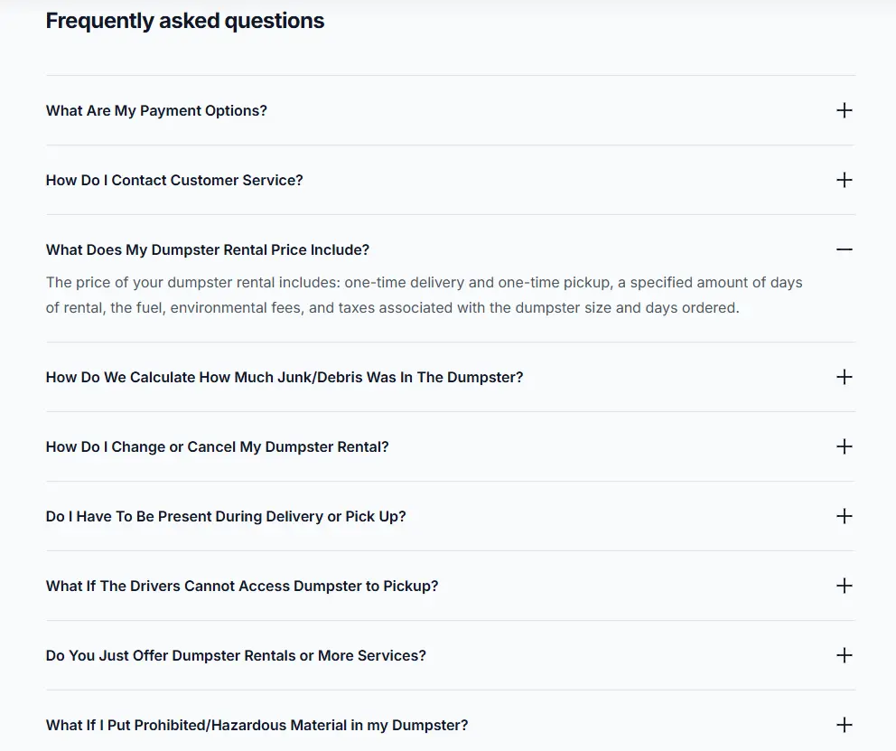

For a junk removal FAQ, consider including questions like:

- **What types of items do you remove?**
    
    Explain the range of items you handle, from furniture and appliances to electronics and yard debris.
    
- **How is pricing determined?**
    
    Offer basic information on pricing structures, such as per-item fees or volume-based rates, and note any additional charges.
    
- **Do you offer eco-friendly disposal options?**
    
    Describe any environmentally-friendly practices, such as recycling or donation options for usable items.
    
- **How does the booking process work?**
    
    Outline the steps for scheduling a pickup, including any required information and estimated response times.
    
- **What’s your cancellation policy?**
    
    Provide details on how to cancel or reschedule a service, along with any associated fees or restrictions.
    
- **Are there extra charges for handling hazardous materials?**
    
    Inform customers about any special fees for items requiring extra care, like batteries or chemicals.
    

An easy-to-navigate FAQ with informative responses also boosts the site’s SEO, as search engines value detailed, customer-focused content that aligns with popular search queries.

## Examples of the Best Junk Removal Web Designs

## 1. Competitive Edge Dumpsters

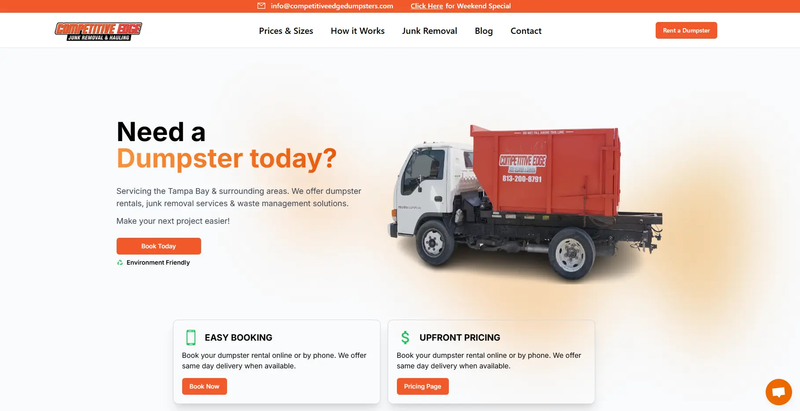

**Website:**  [https://www.competitiveedgedumpsters.com/](https://www.competitiveedgedumpsters.com/)

[**Competitive Edge Dumpsters**](https://www.competitiveedgedumpsters.com), a junk removal and dumpster rental company based in Tampa, FL, stands out for several reasons.

The website's homepage immediately grabs attention with its clear call-to-action: "Need a Dumpster today?" accompanied by a "Book Now" button. This direct approach guides visitors effortlessly to the online booking system.

Additionally, the site features a comprehensive FAQ section, boosting customer confidence in their online transactions. The design is user-friendly and responsive, ensuring a seamless experience across both mobile and desktop devices.

The website received a 100 out of 100 for performance speed, which increases customer satisfaction by eliminating long loading times. This means navigation from page to page is seamless and user friendly.

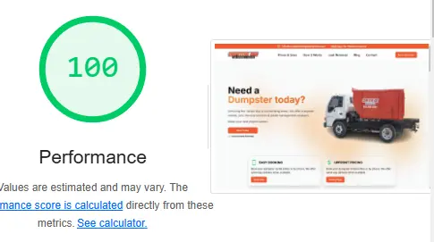

Competitive Edge Dumpsters was designed and developed by [**DevVibe Studio**](https://www.devvibestudio.com)

## 2.  College Hunk

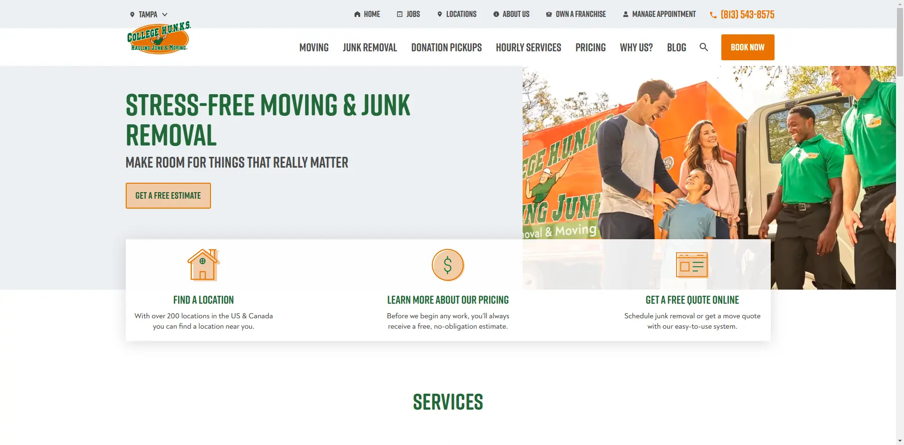

Website: [https://www.collegehunkshaulingjunk.com/](https://www.collegehunkshaulingjunk.com/)

[**College Hunks Hauling Junk's**](https://www.collegehunkshaulingjunk.com/) website excels in several key areas that enhance user experience and drive customer engagement. The clean, modern design features a user-friendly layout, making it easy for visitors to navigate and find information quickly.

Prominent call-to-action buttons encourage users to schedule services or request a quote, streamlining the booking process. The site effectively incorporates vibrant visuals and engaging content, showcasing their team in action and highlighting customer testimonials to build trust and credibility. 

Additionally, the inclusion of a blog section offers valuable tips on moving and decluttering, establishing the brand as an authority in the industry while improving SEO. Overall, the thoughtful design elements and intuitive functionality contribute to a seamless online experience that reflects the company’s commitment to customer satisfaction.

## 3. G.I. Haul Junk Removal

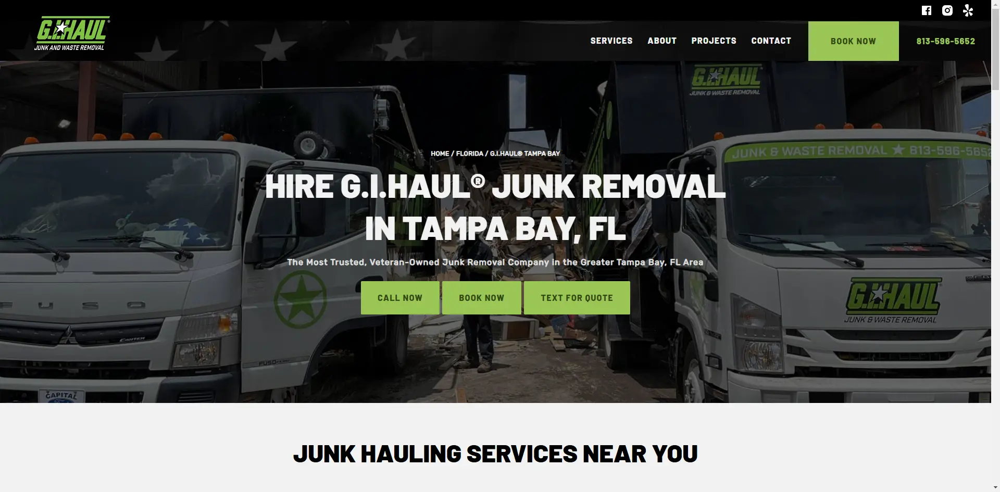

Website: [https://www.gihaul.com/](https://www.gihaul.com/)

[**GI Haul Junk Removal**](https://www.gihaul.com/) has an unique proposition in the fact that they are Veteran owned which can appeal to potential customers since veterans are trustworthy and showcase great quality traits.

The website received a 96 out of 100 for performance speed, which increases customer satisfaction by eliminating long loading times. 

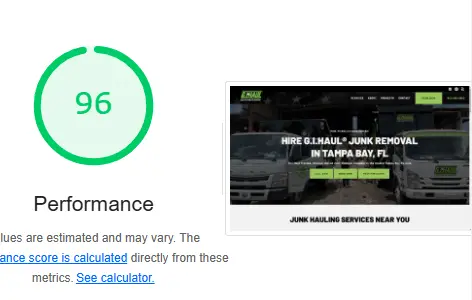

Combines aesthetics and functionality, creating an intuitive user experience that guides visitors through the site effortlessly. It incorporates clear navigation, engaging visuals, and responsive elements that adapt to various devices, ensuring users can access information and services easily, regardless of their platform.

## 4. 1-800-Got-Junk

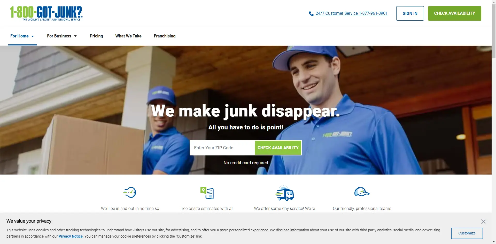

Website: [https://www.1800gotjunk.com/us_en](https://www.1800gotjunk.com/us_en)

[**1-800-GOT-JUNK?**](https://www.1800gotjunk.com/us_en) boasts a great web design that effectively captures user attention with its vibrant color palette and engaging visuals, creating an inviting and energetic atmosphere that reflects the brand's personality. 

The site features intuitive navigation, allowing visitors to quickly find essential information about services, pricing, and booking, while prominent call-to-action buttons encourage users to schedule their junk removal service effortlessly. 

Additionally, the incorporation of customer testimonials and before-and-after images reinforces the company's credibility and showcases the effectiveness of their services, further enhancing the overall user experience.

## 5. Stand Up Guys

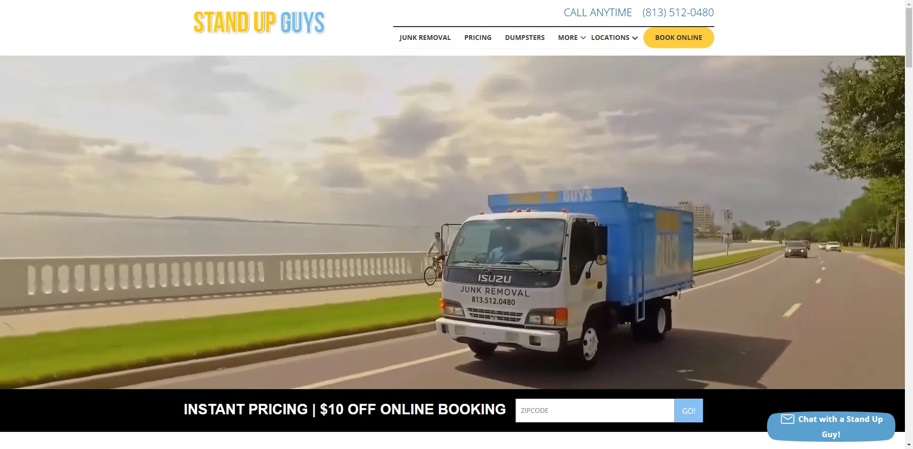

Website: [https://standupguys.biz/florida/](https://standupguys.biz/florida/)

[**Stand Up Guys**](https://standupguys.biz/florida/) does an amazing job showcasing their personalities, even in a "dirty business."

Their quality photos and videos feature their team and show the human side of the business. People do business with people.

The website utilizes a clean layout with clear navigation, making it easy for visitors to access information about their services, pricing, and booking options.

Additionally, the integration of helpful resources like a blog and FAQ section provides valuable information, enhancing SEO while establishing the company as an authority in the junk removal industry.

## 6. Junk Shot

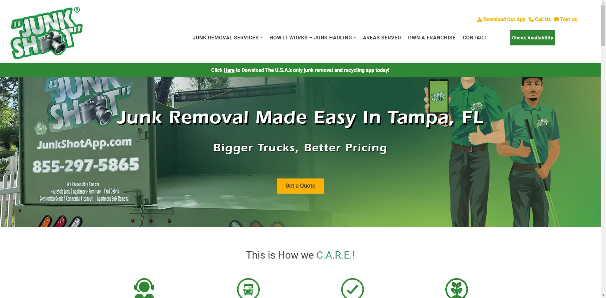

Website: [https://www.junkshotapp.com/tampa/tampa/](https://www.junkshotapp.com/tampa/tampa/)

[**Junk Shot**](https://www.junkshotapp.com/tampa/tampa/) excels in illustrating the advantages of their load sizes, clearly conveying that their full truck load provides customers with exceptional value by maximizing the amount of junk items it can hold, measured in cubic yards. This emphasis on capacity not only showcases the efficiency of their services but also helps potential customers understand how they can get the most out of their investment.

Demonstrates excellent mobile responsiveness in its web design, allowing users to easily access information and services from any device, whether it's a smartphone, tablet, or desktop. The site’s layout adjusts seamlessly to different screen sizes, ensuring that visitors can quickly navigate through service options, pricing details, and booking features without any hassle.

## 7. Junk King

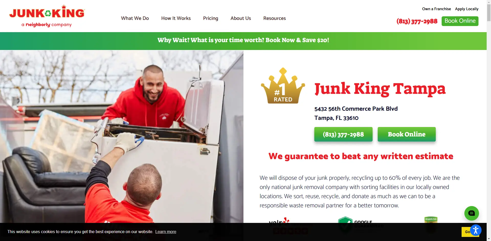

Website: [https://www.junk-king.com/locations/tampa](https://www.junk-king.com/locations/tampa)

[**Junk King**](https://www.junk-king.com/locations/tampa) boasts an impressive web design that focuses on delivering a seamless user experience through its straightforward and visually appealing layout. The site is fully optimized for mobile devices, allowing users to effortlessly browse information about their services, pricing, and scheduling, regardless of the device they are using.

Striking imagery and well-placed calls-to-action enhance navigation, while the inclusion of customer reviews fosters trust and emphasizes the company’s dedication to excellent service. Furthermore, the website features valuable resources, such as a blog and FAQ section, which engage visitors and boost SEO, reinforcing Junk King’s position as a trusted leader in the junk removal sector.

## 8. Junk Buddy

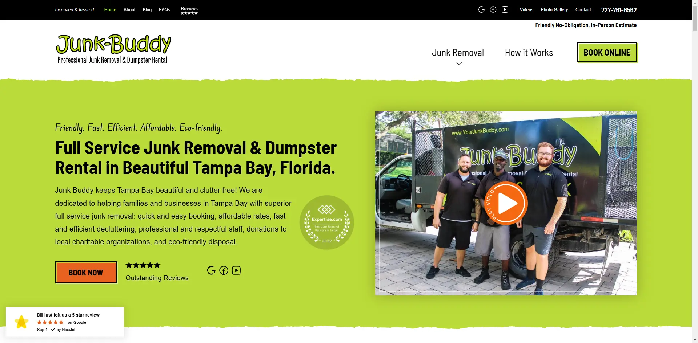

Website: [https://yourjunkbuddy.com/](https://yourjunkbuddy.com/)

[**Junk Buddy's**](https://yourjunkbuddy.com/) website is visually striking, featuring a bold green and black color scheme that reflects the brand's commitment to eco-friendly practices while ensuring easy navigation. The design effectively highlights the variety of services offered, with clear, accessible sections that allow users to quickly understand their options for junk removal. 

The straightforward layout not only makes information easy to find but also emphasizes the online booking feature, enabling customers to schedule services with just a few clicks. 

This user-centric approach enhances the overall experience, making it simple for visitors to engage with Junk Buddy and take advantage of their sustainable junk removal solutions.

## Conclusion

In conclusion, analyzing the web designs of the top eight junk removal companies reveals a common emphasis on user experience, brand identity, and functionality. Each website showcases unique strengths, from intuitive navigation and mobile responsiveness to vibrant color schemes and engaging visuals. The effective use of testimonials, clear service offerings, and streamlined booking processes not only enhances user engagement but also builds trust with potential customers. As the junk removal industry continues to grow, these companies demonstrate that a well-designed website is essential for attracting and retaining clients, ultimately driving business success. By prioritizing accessibility and clarity in their web design, these industry leaders set a standard for others to follow, highlighting the importance of digital presence in today’s competitive market.