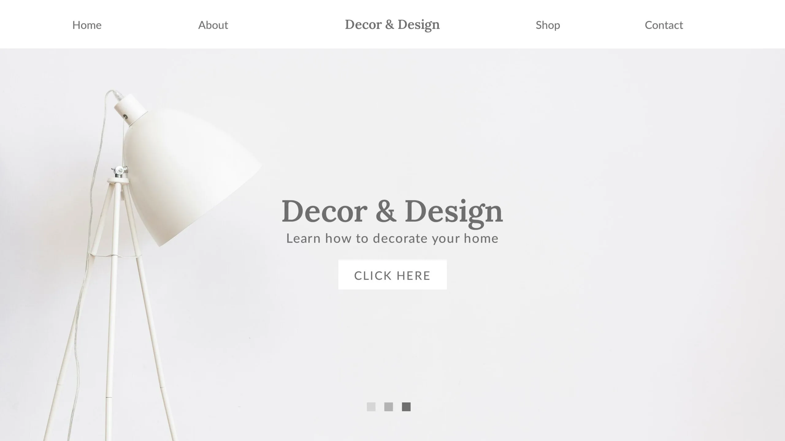

In today’s fast-paced digital landscape, the design of your website plays a crucial role in attracting and retaining visitors. A minimalist website design, characterized by simplicity, clean lines, and ample white space, is more than just an aesthetic choice; it can significantly impact your website’s traffic and user engagement. Here’s how:

## Improved User Experience (UX)

A minimalist website design significantly enhances user experience (UX) by simplifying navigation and prioritizing content. Here’s how it works in more detail:

### a **Ease of Navigation**

In a minimalist design, there is less clutter—fewer buttons, menus, and pop-ups—which makes navigating the site intuitive for users. By providing a clean, straightforward layout, visitors can easily find the information they’re looking for without getting lost in a maze of unnecessary elements. Simple navigation menus and clearly visible links improve usability and keep users engaged for longer periods, preventing them from abandoning the site out of frustration.

### b **Focus on Key Elements**

Minimalist websites eliminate distractions, allowing you to highlight the most important aspects of your site. Whether it’s a product, service, or a specific message, the minimal design directs user attention to the primary content or call-to-action (CTA). Without excessive animations, advertisements, or unnecessary widgets, users are more likely to engage with the elements that matter most to you—such as subscribing to a newsletter or purchasing a product.

### c **Reduced Cognitive Load**

Cognitive load refers to the amount of mental effort required to process information. A busy, cluttered website with multiple elements competing for attention can overwhelm users, leading them to leave the site prematurely. In contrast, a minimalist design reduces cognitive load by presenting content in a simple, organized manner. Users don’t have to overthink or sift through distracting visuals and options; instead, they can quickly grasp the message and take action.

### d **Improved Accessibility**

By reducing the number of design elements and focusing on simplicity, minimalist websites are often more accessible to a wider range of users, including those with disabilities. Clear fonts, sufficient contrast between text and background, and larger clickable areas are common in minimalist designs, making the site easier to use for individuals with visual or motor impairments. When users feel comfortable and accommodated, they are more likely to stay on the site and explore further.

### e **Consistent Experience Across Devices**

Minimalist websites tend to offer a more consistent and seamless experience across different devices, including desktops, tablets, and smartphones. Since minimalism naturally lends itself to responsive design principles, content and functionality are optimized for various screen sizes. This not only ensures that users can access the same content on any device but also provides them with a familiar, easy-to-use interface regardless of how they’re viewing the site.

### f **User Satisfaction and Engagement**

Ultimately, a minimalist design leads to higher user satisfaction because it makes the entire browsing experience enjoyable. Users don’t have to fight through complicated interfaces or deal with slow-loading, overburdened pages. Instead, they can interact with a site that feels light, modern, and user-friendly. When users are satisfied with their experience, they are more likely to stay on the site longer, engage with the content, and return in the future. This engagement directly influences metrics like page views, bounce rate, and return visits, which can all positively impact your traffic.

## **Faster Loading Times**

Minimalist website designs typically include fewer images, animations, and heavy multimedia elements, which significantly reduces the amount of data that needs to be loaded. This streamlined design allows web pages to load more quickly, improving the user experience. Faster loading times are critical because studies show that visitors are more likely to leave a site if it takes longer than 2-3 seconds to load.

**LCP (Largest Contentful Paint)** is a key metric used in web performance analysis to measure how quickly the main content of a webpage loads. It specifically tracks the time it takes for the largest visible element (like a large image, video, or text block) to load and become visible to the user. LCP is part of Google's **Core Web Vitals**, which are metrics designed to assess and improve the user experience.

### How LCP Works:

LCP focuses on how long it takes for the most important, above-the-fold content to be rendered, as this directly impacts user satisfaction. If the largest visible element takes too long to load, users may perceive the page as slow or unresponsive, leading to a poor user experience.

### LCP Best Practices:

To achieve a good LCP score, aim for a loading time of **2.5 seconds or less**. Improving LCP involves optimizing the following areas:

- **Optimizing images**: Compress large images and use modern formats like WebP.
- **Reducing server response times**: Use faster hosting or content delivery networks (CDNs).
- **Minimizing JavaScript and CSS**: Eliminate unnecessary code or defer non-essential scripts.
- **Loading above-the-fold content first**: Prioritize rendering content that is immediately visible to the user.

### Why LCP Matters:

Google uses LCP as a ranking factor for websites, meaning that faster LCP times can improve your SEO. A quick LCP also leads to better user retention, as visitors are more likely to stay on a site that loads quickly.

Additionally, faster websites are favored by search engines like Google, which prioritize speed as a ranking factor, ultimately helping boost your SEO and drive more traffic.

## Mobile-Friendliness

With the growing number of users accessing websites via mobile devices, having a responsive, minimalist design ensures your site looks great on any screen size. Minimalist designs often translate well to mobile, reducing clutter and focusing on essential content. This not only improves the user experience on mobile but also contributes to better mobile SEO performance, as search engines favor mobile-friendly sites.

## Clear Call-to-Actions (CTAs)

Minimalist designs emphasize clarity. With fewer elements competing for attention, your CTAs—whether they are buttons, forms, or links—stand out more. This can result in higher conversion rates as visitors are more likely to notice and engage with your key actions, such as signing up for a newsletter or making a purchase.

## Enhanced SEO Performance

Search engines value simplicity in design. A minimalist approach often means cleaner code, fewer technical issues, and better performance across devices. This makes it easier for search engine bots to crawl and index your site. Additionally, as previously mentioned, faster load times and improved UX both contribute to higher search rankings, helping to drive more organic traffic.

## Focus on Content

Content is king, and a minimalist design puts it front and center. With fewer distractions, your audience can focus on your message, whether it's reading a blog post, watching a video, or exploring your product offerings. Quality content paired with a clean design can lead to higher engagement, social sharing, and return visits.

## Building Trust and Credibility

A minimalist website design can significantly enhance the perception of trust and credibility in the eyes of your visitors. When users visit a website, they make snap judgments based on how it looks and feels, and a cluttered or confusing design can quickly lead to doubt and mistrust. Minimalist design, with its clean and professional aesthetic, helps to foster a sense of transparency, reliability, and professionalism.

Here’s how a minimalist design helps build trust and credibility:

1. **Professional Appearance -** Minimalist websites often look polished and well-organized, which signals professionalism and competence. A clean, modern layout creates an immediate positive impression, conveying that your business or brand is established and takes its digital presence seriously. The focus on quality over quantity in design choices—such as a clear logo, thoughtful typography, and refined color schemes—demonstrates attention to detail, which can reassure users that they are dealing with a credible business.
2. **Transparency and Simplicity** - Simplicity in design can evoke a sense of honesty and transparency. When a website is free of unnecessary elements, distractions, or aggressive sales tactics, users may feel that they are being presented with straightforward, clear information. This openness fosters trust, as visitors can easily understand what your business offers and how to interact with it. A minimalist site makes users feel that you have nothing to hide and that you value their time.
3. **Consistency in Branding** - Minimalist design allows you to maintain consistent branding throughout your website. Consistent use of colors, fonts, and imagery across all pages creates a cohesive experience, which helps to reinforce your brand identity. Users who encounter a strong, consistent brand image are more likely to trust the business behind it, as it signals reliability and professionalism. Inconsistent branding, on the other hand, can create confusion and make a site seem untrustworthy or amateur.
4. **Less Visual Clutter, More Focus -** In a minimalist design, less is more. By removing visual clutter and unnecessary features, the site feels more focused and user-friendly. This lack of chaos can instill confidence in your visitors, as they aren’t overwhelmed by too many options or distracting elements. It gives the impression that you are focused on providing the best experience for the user, not bombarding them with irrelevant information. This sense of focus and clarity is key to building user trust.

   

5. **Better User Experience = Higher Trust** - At its core, minimalist design focuses on the user experience. The more straightforward and enjoyable a website is to navigate, the more trustworthy it feels to the user. Clear navigation, easy-to-read text, and intuitive design all contribute to a smooth experience, leading visitors to view your website—and, by extension, your business—as more credible. A user-friendly website shows that you prioritize the needs of your audience, which builds long-term trust and encourages repeat visits.

## Conclusion

Adopting a minimalist website design is not just about aesthetic appeal; it’s a strategic move that can improve user experience, speed up your site, and boost your search engine rankings. By creating a website that is easy to navigate, mobile-friendly, and fast-loading, you increase the likelihood of attracting and retaining visitors, ultimately driving more traffic to your site.
